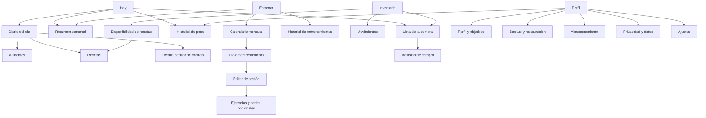

# NutrIAsta — Diseño UX/UI integrado

Estado: **aprobado como especificación de diseño; implementación no autorizada**  
Fecha: 26 de julio de 2026  
Base funcional aprobada: **0.2.1**  
Base Git aprobada: `mvp-1-approved-0.2.1` · `b0cb7620660677e3d166288811c58b0fa15a23cb`  
Versión funcional propuesta para el MVP 2: **0.3.0, no autorizada**  
Implementación, migraciones, dependencias, versión y despliegue: **no autorizados**

## 1. Propósito de esta fase

Este documento define exclusivamente la experiencia y presentación conjunta de:

- nutrición;
- agua;
- entrenamiento;
- historial de peso;
- alimentos y recetas;
- inventario;
- lista de la compra;
- backup, restauración, almacenamiento y privacidad.

No modifica cálculos, esquemas, transacciones, formatos de backup ni reglas de la
especificación funcional. Los wireframes y mockups son documentación, no código de
producción.

La experiencia debe sentirse como un registro personal cotidiano: clara, activa y
amable, nunca como una aplicación clínica ni como una red social.

## 2. Principios de producto

1. **Lo diario primero.** Hoy, registrar y revisar deben requerir pocos pasos.
2. **Estado visible.** El usuario debe saber fecha, conexión, operación y dataset sin
   interpretar señales ambiguas.
3. **Una acción principal por contexto.** Las secundarias permanecen accesibles, pero
   no compiten visualmente.
4. **Confirmaciones proporcionales.** Guardar algo reversible es rápido; eliminar,
   restaurar o aplicar movimientos múltiples exige una revisión explícita.
5. **Offline normal, no degradado.** Trabajar sin conexión mantiene la misma
   estructura y muestra un estado discreto.
6. **Datos, no juicios.** Peso, calorías y cumplimiento se presentan sin mensajes de
   culpa, diagnósticos o valoración corporal.
7. **Accesible por construcción.** Texto, iconos y estados se entienden con color
   desactivado, texto ampliado, teclado y lector de pantalla.
8. **Movimiento informativo.** Las animaciones confirman cambios; nunca sustituyen
   una confirmación ni bloquean operaciones.
9. **Privacidad cercana.** Backup, almacenamiento y borrado deben ser fáciles de
   encontrar antes de que exista un problema.
10. **Sin fotografías corporales.** No habrá pantalla, acceso, permiso, procesado,
    miniatura, tabla ni backup para ellas.

## 3. Auditoría de la interfaz actual

### 3.1 Método y alcance

La auditoría se basa en:

- la compilación estática local existente de la versión 0.2.1;
- inspección visual a 320, 390, 430 y 1.280 px;
- componentes y pantallas aprobados del MVP 1;
- pruebas físicas comunicadas para agua, recetas, backup y actualización;
- especificaciones funcionales aprobadas o en revisión.

No se ha recompilado ni modificado la aplicación. La compilación local sin los datos
IndexedDB del iPhone muestra la superficie de recuperación/Fase 0; las pantallas del
MVP 1 se han auditado además mediante su estructura actual.

### 3.2 Fortalezas que deben conservarse

- identidad reconocible en azul marino y verde;
- icono aprobado de hoja verde y flecha clara;
- fondo claro cálido y tarjetas blancas;
- encabezado oscuro con nombre, versión y estado;
- controles principales de al menos 48 px;
- tarjetas con bordes amplios y jerarquía legible;
- cifras con buena separación entre etiqueta y valor;
- mensajes claros sobre almacenamiento local y backups;
- estados `Online` y `Offline` visibles;
- confirmación de actualización controlada;
- alternativas manuales cuando una función del navegador no está disponible;
- correcciones adaptables ya validadas en agua y recetas;
- ausencia de desbordamiento horizontal en la superficie auditada entre 320 y 430 px;
- ancho máximo que evita líneas excesivamente largas.

### 3.3 Problemas observados

#### Navegación

- Las pestañas actuales son botones que envuelven a varias filas; no forman una
  navegación persistente de aplicación.
- `Alimentos`, `Recetas`, `Perfil y objetivos` y `Ajustes y privacidad` compiten al
  mismo nivel aunque tengan frecuencias de uso distintas.
- El backup aparece al final de la pantalla principal, fuera de un destino claro.
- En páginas largas se pierde contexto y volver a otra función exige mucho
  desplazamiento.

#### Jerarquía

- Muchas tarjetas tienen el mismo peso visual aunque unas sean resumen y otras sean
  formularios avanzados.
- La cabecera técnica ocupa una parte grande del primer viewport diario.
- Estados técnicos, funcionales y advertencias usan formas similares.
- Los resúmenes nutricionales son líneas de texto correctas, pero no permiten
  comparar el progreso del día de un vistazo.

#### Formularios

- Numerosas funciones aparecen juntas en una sola página vertical.
- Algunos flujos actuales utilizan diálogos nativos del navegador, que ofrecen poca
  jerarquía, contexto y control accesible.
- Acciones de edición, copia y eliminación pueden acumularse dentro de la tarjeta.
- Los formularios no distinguen suficientemente datos obligatorios, opcionales y
  calculados.

#### Escritorio

- El contenido actual se limita aproximadamente a 720 px y mantiene botones de ancho
  completo; es seguro, pero desaprovecha el espacio de ordenador.
- No existe una estructura lateral que mantenga navegación y resumen visibles.

#### Estados

- El estado vacío tiene poco apoyo visual y pocas acciones contextuales.
- Falta una diferenciación sistemática entre:
  - guardando;
  - operación local terminada;
  - operación pendiente de confirmación;
  - candidato de restauración preparado;
  - error recuperable;
  - bloqueo que impide continuar.

### 3.4 Resultado de adaptación observado

En la superficie local auditada:

| Ancho | Resultado |
|---:|---|
| 320 px | Sin desplazamiento horizontal; botones dentro del contenido |
| 390 px | Sin desplazamiento horizontal; lectura cómoda |
| 430 px | Sin desplazamiento horizontal; tarjetas aprovechan el ancho |
| 1.280 px | Sin desbordamiento, pero demasiado espacio lateral y acciones muy anchas |

La nueva propuesta conserva la seguridad móvil y añade una composición específica
para escritorio.

## 4. Arquitectura de navegación

### 4.1 Decisión

Se mantienen las cinco secciones propuestas:

1. `Hoy`;
2. `Diario`;
3. `Entrenar`;
4. `Inventario`;
5. `Perfil`.

Es una estructura equilibrada porque:

- las tres actividades más frecuentes tienen destino propio: hoy, registrar comida y
  entrenar;
- inventario y compra comparten alimentos, cantidades y movimientos;
- perfil agrupa datos personales, objetivos, peso y protección de datos;
- evita seis o siete pestañas imposibles de leer a 320 px.

En iPhone serán cinco destinos persistentes en la barra inferior. En ordenador serán
los mismos cinco destinos en una barra lateral. No cambiarán nombres ni jerarquía
entre dispositivos.

### 4.2 Acceso explícito a todas las funciones

| Función | Acceso principal | Acceso secundario visible |
|---|---|---|
| Hoy | Pestaña `Hoy` | Botón `Volver a hoy` en selectores de fecha |
| Diario | Pestaña `Diario` | Tarjeta de nutrición de Hoy |
| Alimentos | Botón `Alimentos` en la cabecera de Diario | Acceso `Gestionar alimentos` al añadir |
| Recetas | Botón `Recetas` en la cabecera de Diario | Acceso desde disponibilidad en Inventario |
| Entrenamiento | Pestaña `Entrenar` | Tarjeta semanal de Hoy |
| Calendario mensual | Inicio de `Entrenar` | Botón `Ver calendario` en Hoy |
| Historial de entrenamiento | Botón con texto en `Entrenar` | Resumen semanal |
| Inventario | Pestaña `Inventario` | Avisos de existencias en Hoy |
| Lista de la compra | Selector visible `Existencias · Compra` | Tarjeta de compra en Hoy |
| Movimientos | Botón `Ver movimientos` en cada alimento | Resumen de Inventario |
| Disponibilidad de recetas | Botón `Qué puedo preparar` | Detalle de una receta |
| Perfil | Pestaña `Perfil` | Alias o avatar tipográfico de Hoy |
| Objetivos nutricionales | Tarjeta `Objetivos` en Perfil | Indicadores diarios |
| Historial de peso | Tarjeta `Peso` en Perfil | Resumen neutral en Hoy |
| Backup y restauración | Fila visible `Backup y restauración` en Perfil | Aviso de backup en Hoy |
| Almacenamiento | Fila visible `Almacenamiento` en Perfil | Aviso cuando falta persistencia o cuota |
| Privacidad y borrado | Fila visible `Privacidad y datos` en Perfil | Dentro de Ajustes |
| Ajustes | Fila visible `Ajustes` en Perfil | Botón con icono y texto en cabecera de Perfil |

Ninguna función depende de deslizar, mantener pulsado o conocer un gesto. Los gestos
podrán ser una comodidad duplicada, nunca el único acceso.

### 4.3 Mapa de navegación



### 4.4 Comportamiento de la navegación

- cada pestaña conserva su posición y fecha seleccionada durante la sesión;
- pulsar de nuevo la pestaña activa vuelve a su pantalla raíz;
- el botón Atrás del navegador y los controles visibles funcionan de forma coherente;
- los editores se abren como página completa en 320–430 px;
- las confirmaciones breves se muestran como hoja inferior accesible;
- backup, restauración y borrado usan página o diálogo amplio, no una hoja pequeña;
- enlaces profundos locales podrán abrir un día, sesión, alimento o receta;
- el foco vuelve al control de origen al cerrar un diálogo;
- cambiar de pestaña no cancela una escritura ya iniciada.

## 5. Estructura global de pantalla

### 5.1 iPhone

1. área segura superior;
2. cabecera compacta con título y estado;
3. contenido desplazable;
4. región de mensajes no superpuesta;
5. barra inferior persistente;
6. área segura inferior.

La cabecera diaria no repetirá una gran tarjeta de marca en todas las pantallas. El
logotipo completo se reservará para carga, bienvenida y acerca de. El resto usará un
título de pantalla y una hoja pequeña como identidad.

### 5.2 Ordenador

- navegación lateral fija de 216–232 px;
- contenido máximo de 1.200 px;
- cuadrícula de dos columnas cuando aporte valor;
- formularios con columna principal de 640–720 px;
- panel secundario para resumen, ayuda o estado;
- tablas y gráficas con mayor anchura;
- las mismas acciones y textos que en iPhone.

### 5.3 Puntos de adaptación

| Intervalo | Composición |
|---|---|
| 320–359 px | Una columna, 12 px laterales, grupos de botones apilados |
| 360–430 px | Una columna, 16 px laterales, acciones cortas en dos columnas |
| 431–899 px | Contenido centrado de hasta 720 px, navegación inferior |
| 900 px o más | Navegación lateral, contenido de hasta 1.200 px y cuadrícula |

No se utilizará el ancho calculado del navegador como condición para mostrar un
contenedor válido: el primer render siempre tendrá `width: 100%` y límites mediante
flexbox.

## 6. Sistema visual

### 6.1 Identidad

La identidad conserva:

- azul profundo como base estable y privada;
- verde hoja como acento de actividad;
- fondo verde grisáceo muy claro;
- icono de hoja verde y flecha clara sobre azul.

El concepto visual es **“registro que avanza”**, no “control médico”.

### 6.2 Paleta propuesta

| Token | Color | Uso |
|---|---|---|
| `brand-900` | `#071A2F` | Cabeceras, navegación seleccionada, botón principal |
| `brand-700` | `#12304E` | Texto secundario oscuro, iconos |
| `leaf-500` | `#24C978` | Acento gráfico y progreso con texto oscuro |
| `leaf-700` | `#11784B` | Texto verde, borde activo, confirmación |
| `leaf-100` | `#DCF8EA` | Fondo de éxito o selección |
| `surface` | `#FFFFFF` | Tarjetas y formularios |
| `canvas` | `#F4F7F5` | Fondo general |
| `ink` | `#0D1F2D` | Texto principal |
| `muted` | `#64727C` | Texto secundario |
| `border` | `#DCE5DF` | Separadores y campos |
| `info` | `#225E85` | Información y estado offline |
| `info-bg` | `#EAF5FF` | Fondo informativo |
| `warning` | `#8A5300` | Advertencia |
| `warning-bg` | `#FFF2D8` | Fondo de advertencia |
| `danger` | `#A63333` | Destructivo y error |
| `danger-bg` | `#FDE8E8` | Fondo de error |
| `neutral-100` | `#E9EEF2` | Estado neutral |

Reglas:

- `leaf-500` no se utilizará como texto pequeño sobre blanco;
- texto blanco solo sobre colores que superen contraste;
- éxito, advertencia y error siempre tendrán icono y texto;
- el peso usará azul neutral, nunca verde/rojo para indicar “mejor” o “peor”;
- los tipos de entrenamiento pueden tener color decorativo, pero conservarán nombre.

### 6.3 Tipografía

No se descargarán fuentes. Se utilizará la pila del sistema:

`-apple-system`, `BlinkMacSystemFont`, `Segoe UI`, `sans-serif`.

| Estilo | Tamaño base | Peso | Uso |
|---|---:|---:|---|
| Display | 32–34 px | 800–900 | Bienvenida o resumen excepcional |
| Título | 26–28 px | 800 | Título de pantalla |
| Sección | 20 px | 750–800 | Título de tarjeta o bloque |
| Cuerpo | 16 px | 400–600 | Lectura y campos |
| Etiqueta | 14 px | 600–700 | Etiquetas, ayuda y navegación |
| Meta | 12–13 px | 600–700 | Fecha, estado y texto auxiliar |

- inputs: mínimo 16 px para evitar zoom automático de iOS;
- cifras: números tabulares;
- altura de línea: 1,35–1,5;
- no usar mayúsculas sostenidas en frases;
- las cejas de sección podrán mantener mayúsculas breves;
- el diseño soportará ampliación de texto al 200 % sin ocultar contenido.

### 6.4 Espaciado y forma

- escala: 4, 8, 12, 16, 24, 32 y 40 px;
- tarjeta compacta: 16 px;
- tarjeta destacada: 20 px;
- radio de campo: 12–14 px;
- radio de tarjeta: 18–22 px;
- radio de cabecera destacada: 24–28 px;
- sombra tenue solo para elevación real;
- separadores para listas densas en lugar de una tarjeta por fila.

### 6.5 Iconografía

La PWA no dependerá de SF Symbols, iconos remotos ni una fuente de iconos. Se
definirá posteriormente un conjunto local de SVG de trazo coherente, sobre cuadrícula
de 24 px, con etiquetas accesibles.

| Destino o acción | Concepto de icono |
|---|---|
| Hoy | casa/sol |
| Diario | cuaderno |
| Entrenar | mancuerna |
| Inventario | caja/despensa |
| Perfil | persona |
| Alimentos | manzana |
| Recetas | bol o cubiertos |
| Compra | cesta |
| Peso | báscula |
| Backup | archivo con flecha |
| Restaurar | flecha circular hacia archivo |
| Offline | nube desconectada |
| Pendiente | reloj |
| Éxito | círculo con marca |
| Advertencia | triángulo |
| Error | círculo con cruz |
| Editar | lápiz |
| Eliminar | papelera |

Todo icono de acción tendrá texto visible o nombre accesible. No se utilizarán emojis
como iconografía principal.

## 7. Componentes

### 7.1 Navegación inferior

- altura de contenido: 56 px más área segura;
- cinco destinos de igual anchura;
- icono de 20–22 px y texto de 10–12 px;
- estado seleccionado con icono relleno, texto y fondo sutil;
- indicador de foco visible;
- sin desplazamiento horizontal;
- `Inventario` puede ocupar dos líneas solo con texto ampliado, aumentando la barra.

### 7.2 Cabecera

- título a la izquierda;
- estado `Offline` o actualización a la derecha;
- acción secundaria con icono y texto cuando sea crítica;
- fecha debajo del título en pantallas diarias;
- no más de dos acciones visibles en cabecera.

### 7.3 Tarjetas

Tipos:

1. **Resumen:** cifra, unidad, contexto y acceso.
2. **Acción:** texto breve y botón principal.
3. **Lista:** filas con separadores.
4. **Advertencia:** motivo, impacto y opciones.
5. **Técnica:** almacenamiento, backup o versión.
6. **Transacción:** resumen “antes y después”.

Una tarjeta entera podrá ser pulsable solo si tiene rol, foco y una etiqueta que
describa el destino. Las acciones destructivas serán botones separados.

### 7.4 Botones

| Variante | Uso |
|---|---|
| Primario | Guardar, confirmar o continuar |
| Secundario | Editar, copiar, revisar |
| Positivo | Completar entrenamiento o compra |
| Peligro | Eliminar o descartar candidato |
| Silencioso | Cancelar, volver o acciones de baja prioridad |

- alto mínimo: 48 px;
- zona táctil mínima: 44 × 44 px;
- etiqueta que describa la acción y el objeto;
- estado ocupado con texto: `Guardando…`, `Verificando…`, `Activando…`;
- el botón ocupado evita dobles pulsaciones sin ocultar el estado;
- a 320–359 px, los grupos de acciones se apilan;
- una fila tendrá como máximo dos acciones breves.

### 7.5 Formularios

- etiqueta siempre visible encima;
- sufijo de unidad dentro del campo o a su derecha;
- ayuda breve debajo;
- error junto al campo y resumen al comienzo;
- opcional indicado explícitamente;
- teclado numérico para cantidades;
- selector de fecha visible, con anterior, hoy y siguiente cuando corresponda;
- valor calculado en bloque de solo lectura;
- confirmación al abandonar con cambios sin guardar;
- campos relacionados agrupados por intención.

Los diálogos genéricos del navegador se sustituirán visualmente por diálogos o hojas
propios, accesibles y con contexto. Esta decisión es de diseño; su implementación
necesitará autorización.

### 7.6 Indicadores

#### Calorías

- cifra consumida y objetivo manual;
- barra lineal con marcador de objetivo;
- texto de diferencia neutral;
- si supera el objetivo, la barra continúa y el texto muestra el valor real sin rojo.

#### Macronutrientes

- tres barras compactas para proteína, carbohidratos y grasa;
- cifra `consumido / objetivo`;
- color, abreviatura y nombre accesible.

#### Agua

- progreso en ml;
- accesos rápidos;
- historial editable en pantalla de detalle;
- ninguna metáfora que implique recomendación médica.

#### Entrenamiento semanal

- anillo o barra segmentada con días completados;
- texto `3 de 4 entrenamientos`;
- días planificados diferenciados de completados;
- si se supera: `5 realizados · objetivo 4`.

## 8. Calendario y estados de sesión

### 8.1 Calendario mensual

- lunes como primer día;
- siete columnas estables;
- controles `Anterior`, `Hoy` y `Siguiente`;
- mes y año anunciados al lector de pantalla;
- cada celda tiene número, estado y hasta dos marcadores de tipo;
- más tipos se representan como `+2`, con texto accesible completo;
- altura mínima de celda: 48 px en 320 px y 56 px desde 390 px;
- el día seleccionado tiene borde grueso y no solo color.

### 8.2 Estados

| Estado | Forma | Texto accesible |
|---|---|---|
| Sin sesión | Día neutro | `Sin entrenamiento` |
| Planificada | Contorno azul + punto | `Planificada` |
| Completada | Fondo verde suave + marca | `Completada` |
| Planificada y completada | Marca + contorno | `Planificada y completada` |
| Cancelada | Línea diagonal + texto | `Cancelada` |
| Hoy | Anillo exterior | `Hoy` |
| Seleccionada | Borde oscuro | `Seleccionada` |

## 9. Gráfica de peso

La gráfica será informativa y no clínica:

- línea azul neutral con puntos seleccionables;
- periodos `1 mes`, `3 meses`, `6 meses`, `1 año` y `Todo`;
- eje horizontal con fechas;
- eje vertical adaptado al intervalo visible, indicando claramente que no comienza
  necesariamente en cero;
- tooltip accesible con fecha y peso;
- resumen textual: primera entrada, última entrada y diferencia matemática;
- sin flechas verdes o rojas;
- sin “peso ideal”, tendencia médica, predicción o recomendación;
- alternativa en lista o tabla para lector de pantalla;
- estado vacío con `Añadir primer peso`;
- varias entradas del día siguen disponibles en el historial.

## 10. Estados de inventario

| Estado | Presentación |
|---|---|
| Disponible | Cantidad canónica y acceso a movimientos |
| Se agotará | Advertencia ámbar antes de confirmar |
| Agotado | `0 g` o `0 ml`, icono y botón `Añadir a compra` |
| Insuficiente | Solicitado, disponible y faltante |
| Diferencia | Etiqueta `Inventario no exacto para este consumo` |
| Sin equivalencia | Bloqueo con acción `Definir equivalencia` |
| Unidad incompatible | Mensaje explícito, sin conversión |
| Operación pendiente | Bloqueo local de la acción duplicada |

El catálogo de alimentos nunca se confunde visualmente con el inventario:

- `Alimentos` describe información nutricional;
- `Inventario` describe cantidad disponible;
- una ficha puede enlazar ambos contextos.

## 11. Confirmaciones transaccionales

### 11.1 Estructura común

Cada confirmación compleja mostrará:

1. qué se va a cambiar;
2. valores actuales;
3. valores resultantes;
4. avisos y decisiones;
5. elementos relacionados;
6. acción principal;
7. cancelar sin cambios.

Durante la confirmación no se escribe. Al pulsar la acción principal:

- el botón muestra `Aplicando…`;
- las demás acciones se bloquean;
- la operación local continúa aunque se reduzcan animaciones;
- al terminar aparece resultado;
- si falla, toda la interfaz vuelve al estado anterior y explica que no hubo cambios.

### 11.2 Agotamiento

Título: `Se va a acabar carne picada`  
Resumen: `Disponible 200 g · Consumo 200 g · Después 0 g`

Acciones:

- `Consumir y añadir a compra`;
- `Consumir sin añadir`;
- `Cancelar`.

### 11.3 Insuficiencia

Título: `No hay suficiente carne picada`  
Resumen: `Solicitado 250 g · Disponible 200 g · Faltan 50 g`

Acciones:

- `Descontar 200 g disponibles`;
- `No descontar inventario`;
- `Cancelar y corregir`.

La primera opción añade una advertencia persistente:
`La nutrición conserva 250 g. El inventario queda a 0 g y no representa todo el
consumo.`

### 11.4 Receta con varios ingredientes

La hoja muestra una fila por ingrediente y un resumen:

- `2 disponibles`;
- `1 se agotará`;
- `1 insuficiente`;
- decisiones seleccionadas;
- posibles entradas de compra.

No existe un botón por ingrediente que escriba inmediatamente. Solo
`Confirmar consumo completo` inicia la operación atómica.

### 11.5 Deshacer compra

La revisión muestra:

- compra original;
- movimientos que se invertirán;
- saldo posterior;
- elementos que volverán a la lista;
- bloqueo completo si algún saldo sería negativo.

Acciones:

- `Deshacer compra`;
- `Conservar compra`.

## 12. Mensajes y estados globales

### 12.1 Éxito

- mensaje breve en una región anunciable;
- icono de confirmación;
- texto concreto: `Sesión completada`, `Compra añadida al inventario`;
- desaparece visualmente tras unos segundos, pero queda reflejado en la pantalla.

### 12.2 Error

- explica qué no se hizo;
- conserva los valores introducidos;
- ofrece `Intentar de nuevo` cuando sea seguro;
- para transacciones: `No se modificaron nutrición ni inventario`.

### 12.3 Offline

- etiqueta compacta y persistente `Offline`;
- texto ampliado solo una vez: `Puedes seguir usando todos los datos locales`;
- no usar un modal que interrumpa;
- al recuperar red: `Online`; ningún dato cambia ni se sincroniza.

### 12.4 Operación pendiente

- barra o tarjeta fija dentro de la pantalla;
- nombre de operación;
- progreso solo si es real;
- texto indeterminado si no puede medirse;
- navegación limitada únicamente cuando abandonar rompería el flujo;
- nunca se activa una actualización mientras exista.

### 12.5 Actualización

- banner: `Nueva versión disponible`;
- explicación: `Se activará cuando tú lo decidas`;
- botón `Actualizar`;
- si hay una operación: `Actualizar cuando termine`;
- nunca se recarga automáticamente.

### 12.6 Estados vacíos

Cada vacío contiene:

- icono local decorativo;
- título concreto;
- una explicación de una frase;
- una acción principal;
- ninguna ilustración remota.

Ejemplos:

| Pantalla | Título | Acción |
|---|---|---|
| Diario | `Aún no has registrado comidas` | `Añadir alimento` |
| Entrenar | `No hay sesiones este mes` | `Planificar entrenamiento` |
| Peso | `Todavía no hay pesos guardados` | `Añadir primer peso` |
| Inventario | `Tu inventario está vacío` | `Añadir alimento disponible` |
| Compra | `No hay nada pendiente` | `Añadir a la compra` |
| Recetas | `Aún no tienes recetas` | `Crear receta` |

## 13. Wireframes

Los wireframes muestran jerarquía y navegación, no acabados visuales.

### 13.1 Estructura iPhone

```text
┌──────────────────────────────────┐
│ área segura                      │
│ Título                   Offline │
│ contexto / fecha                 │
├──────────────────────────────────┤
│                                  │
│ contenido desplazable            │
│ tarjetas, listas y formularios   │
│                                  │
│                                  │
├──────────────────────────────────┤
│ Hoy  Diario  Entrenar  Inv. Perf.│
│ área segura inferior             │
└──────────────────────────────────┘
```

### 13.2 Hoy

```text
┌──────────────────────────────────┐
│ Buenos días                      │
│ domingo, 26 de julio     Offline │
├──────────────────────────────────┤
│ CALORÍAS                         │
│ 1.480 / 2.200 kcal   [──────··]  │
│ P 92/140  C 150/250  G 55/70     │
│              [Abrir diario]      │
├──────────────────────────────────┤
│ AGUA             1.250 / 2.000 ml│
│ [+250] [+500]       [Ver detalle]│
├──────────────────────────────────┤
│ ENTRENAMIENTO             3 de 4 │
│ Hoy · Pecho + tríceps · 18:00    │
│ [Completar]   [Abrir semana]     │
├──────────────────────────────────┤
│ EN CASA                          │
│ 2 alimentos por agotarse         │
│ 4 cosas en la compra   [Revisar] │
├──────────────────────────────────┤
│ Hoy Diario Entrenar Invent. Perfil│
└──────────────────────────────────┘
```

### 13.3 Diario

```text
┌──────────────────────────────────┐
│ Diario                           │
│ ‹  sábado 25  [Hoy]  domingo 27 ›│
│ [Alimentos] [Recetas]            │
├──────────────────────────────────┤
│ Resumen nutricional              │
│ calorías + tres macros           │
├──────────────────────────────────┤
│ Desayuno                 420 kcal│
│  Avena · 80 g                    │
│  Leche · 250 ml                  │
│                 [Editar comida]  │
├──────────────────────────────────┤
│ Comida                    Vacía   │
│                [Añadir alimento] │
├──────────────────────────────────┤
│ [+ Añadir]                       │
└──────────────────────────────────┘
```

### 13.4 Entrenamiento

```text
┌──────────────────────────────────┐
│ Entrenar                         │
│ ‹        julio 2026         ›    │
│ L  M  X  J  V  S  D              │
│       1  2  3  4  5              │
│ 6  7 [8] 9 10 11 12             │
│      ✓      ○                    │
│ 13 14 15 16 17 18 19            │
│ ...                              │
├──────────────────────────────────┤
│ Esta semana             3 de 4   │
│ ✓ lun  ✓ mié  ○ vie  ✓ sáb       │
│ [Planificar] [Ver resumen]       │
├──────────────────────────────────┤
│ [Historial de entrenamientos]    │
└──────────────────────────────────┘
```

### 13.5 Editor de sesión

```text
┌──────────────────────────────────┐
│ Cancelar      Sesión      Guardar│
│ Estado: Planificada              │
├──────────────────────────────────┤
│ Fecha  27/07/2026   Hora opcional│
│ Tipos [Pecho ✓] [Tríceps ✓] [+]  │
│ Nota general (opcional)          │
├──────────────────────────────────┤
│ Ejercicios opcionales            │
│ Press banca                      │
│  #   kg      rep.   hecha        │
│  1   50      10       ✓          │
│  2   50      8        ○          │
│  [+ Añadir serie]                │
│                                  │
│ [+ Añadir ejercicio]             │
└──────────────────────────────────┘
```

### 13.6 Inventario

```text
┌──────────────────────────────────┐
│ Inventario                       │
│ [Existencias] [Compra · 4]       │
│ Buscar…                          │
├──────────────────────────────────┤
│ Carne picada              200 g  │
│ Disponible          [Movimientos]│
├──────────────────────────────────┤
│ Leche                       0 ml  │
│ Agotado             [A la compra]│
├──────────────────────────────────┤
│ Arroz                      450 g  │
│ Disponible          [Movimientos]│
├──────────────────────────────────┤
│ [Qué puedo preparar]   [+ Añadir]│
└──────────────────────────────────┘
```

### 13.7 Perfil y protección de datos

```text
┌──────────────────────────────────┐
│ Perfil                           │
│ Persona ficticia                 │
├──────────────────────────────────┤
│ Datos y actividad              › │
│ Objetivos nutricionales        › │
│ Peso e historial              70 │
├──────────────────────────────────┤
│ Backup y restauración    Hace 2 d│
│ Almacenamiento       Persistente │
│ Privacidad y datos             › │
│ Ajustes                        › │
├──────────────────────────────────┤
│ Versión y funcionamiento local   │
└──────────────────────────────────┘
```

## 14. Mockups representativos para iPhone

Estos mockups documentales añaden color, peso visual y estados a los wireframes. No
son capturas ni recursos de producción.

### 14.1 Mockup A — Hoy equilibrado

```text
╭──────────────────────────────────╮  canvas #F4F7F5
│  hoja  HOY              ◌ Offline│  cabecera compacta
│  Domingo, 26 de julio            │
│                                  │
│ ╭──────────────────────────────╮ │
│ │ Tu día                       │ │  brand-900
│ │ 1.480 / 2.200 kcal  67 %     │ │  blanco sobre azul
│ │ █████████████░░░░░░          │ │
│ │ P 92/140  C 150/250  G 55/70 │ │
│ │                    Ver diario│ │
│ ╰──────────────────────────────╯ │
│                                  │
│ ╭──────────────╮ ╭─────────────╮│
│ │ Agua         │ │ Entrenos    ││
│ │ 1.250 ml     │ │ 3 de 4      ││
│ │ +250  +500   │ │ Próx. hoy   ││
│ ╰──────────────╯ ╰─────────────╯│
│                                  │
│ ╭──────────────────────────────╮ │
│ │ ⚠ 2 alimentos se agotarán   │ │  warning-bg + icono
│ │ 4 pendientes en la compra    │ │
│ │                 Revisar lista│ │
│ ╰──────────────────────────────╯ │
│                                  │
│  Hoy Diario Entrenar Inv. Perfil│  barra segura
╰──────────────────────────────────╯
```

### 14.2 Mockup B — Calendario atractivo

```text
╭──────────────────────────────────╮
│ ‹  Julio 2026  ›           [Hoy] │
│ L   M   X   J   V   S   D        │
│         1   2   3   4   5        │
│ 6   7  [8]  9  10  11  12       │
│        ✓         ○               │
│ 13  14  15  16  17  18  19      │
│  ●      ✓                       │
│ 20  21  22  23  24  25  26      │
│ 27  28  29  30  31              │
│                                  │
│ ╭──────────────────────────────╮ │
│ │ Semana 27–2 ago.     3 de 4 │ │
│ │ ✓ Pecho · ✓ Pierna · ○ Cardio│ │
│ │ ███████████████░░░░          │ │
│ │ [Planificar] [Ver la semana] │ │
│ ╰──────────────────────────────╯ │
│  Hoy Diario Entrenar Inv. Perfil│
╰──────────────────────────────────╯
```

Leyenda visible bajo el calendario: `✓ Completada · ○ Planificada · / Cancelada`.

### 14.3 Mockup C — Aviso de inventario

```text
╭──────────────────────────────────╮
│ fondo atenuado                   │
│                                  │
│ ╭──────────────────────────────╮ │
│ │ ⚠ Se va a acabar             │ │
│ │ Carne picada                 │ │
│ │                              │ │
│ │ Disponible        200 g      │ │
│ │ Este consumo      200 g      │ │
│ │ Después             0 g      │ │
│ │ ──────────────────────────── │ │
│ │ ¿Añadir a la lista?          │ │
│ │                              │ │
│ │ [Consumir y añadir a compra] │ │
│ │ [Consumir sin añadir]        │ │
│ │ [Cancelar]                   │ │
│ ╰──────────────────────────────╯ │
╰──────────────────────────────────╯
```

El primer botón es principal. `Cancelar` permanece visible y el lector de pantalla
recibe primero título, impacto y valores.

### 14.4 Mockup D — Restauración segura

```text
╭──────────────────────────────────╮
│ Restaurar backup                 │
│ Paso 2 de 3 · Revisar candidato  │
├──────────────────────────────────┤
│ ✓ Archivo descifrado             │
│ ✓ Formato 3 compatible           │
│ ✓ Checksums verificados          │
│                                  │
│ Exportado 26/07/2026 · 18:42     │
│ 24 comidas · 8 sesiones          │
│ 12 alimentos · 4 pesos           │
│ 14,8 MB                          │
│                                  │
│ Tus datos actuales siguen activos│
│ y se conservarán para volver.    │
│                                  │
│ [Activar candidato]              │
│ [Cancelar sin cambiar datos]     │
╰──────────────────────────────────╯
```

Tras activar:

```text
╭──────────────────────────────────╮
│ Restauración pendiente           │
│ Estás viendo el candidato.       │
│ Los datos anteriores se conservan│
│                                  │
│ [Confirmar restauración]         │
│ [Volver a datos anteriores]      │
╰──────────────────────────────────╯
```

### 14.5 Mockup de escritorio

```text
┌───────────────┬──────────────────────────────────────────────────────┐
│ hoja NutrIAsta│ Hoy · domingo, 26 de julio                  Offline │
│               ├───────────────────────────┬──────────────────────────┤
│ Hoy           │ Nutrición                 │ Entrenamiento semanal    │
│ Diario        │ calorías + macros         │ calendario compacto      │
│ Entrenar      ├───────────────────────────┼──────────────────────────┤
│ Inventario    │ Comidas del día           │ Agua e inventario        │
│ Perfil        │                           │                          │
│               │                           │                          │
│ versión       │                           │                          │
└───────────────┴───────────────────────────┴──────────────────────────┘
```

## 15. Diseño por pantalla

### 15.1 Hoy

Orden:

1. fecha y estado offline;
2. nutrición y macros;
3. agua;
4. entrenamiento semanal y próxima sesión;
5. inventario y compra;
6. peso reciente, sin interpretación;
7. avisos de backup solo cuando sean relevantes.

La pantalla no repetirá formularios completos; cada tarjeta lleva al destino.

### 15.2 Diario y selector de fecha

- fecha central y botones anterior/siguiente;
- botón `Hoy`;
- acceso visible a alimentos y recetas;
- resumen consumido;
- resumen planificado separado;
- secciones desayuno, comida, cena y tentempiés;
- botón flotante no exclusivo: también habrá botón textual `Añadir`;
- copiar día y comida dentro de acciones secundarias visibles;
- agua accesible desde su tarjeta y detalle.

### 15.3 Alimentos

- búsqueda;
- filtros `Recientes`, `Favoritos`, `Todos`, `Archivados`;
- nombre, supermercado, EAN y valores por 100 g/ml;
- fotografía de producto solo cuando exista;
- acción `Añadir al diario`;
- acción `Ver en inventario`;
- editor dividido en información, nutrición, porciones y etiqueta/EAN.

### 15.4 Recetas

- búsqueda y filtros;
- total por receta y por porción;
- ingredientes;
- favorito y archivado como acciones adaptables;
- `Comprobar disponibilidad`;
- `Añadir al diario`;
- editor por pasos breves: datos, ingredientes y porciones.

### 15.5 Calendario y resumen semanal

- calendario como raíz de `Entrenar`;
- resumen de semana debajo del mes;
- acceso a historial;
- objetivo y periodo efectivo desde un lunes;
- selector de objetivo muestra la fecha exacta antes de guardar.

### 15.6 Día y sesión

- lista de sesiones del día;
- `Planificar sesión`;
- `Registrar entrenamiento realizado`;
- editor con datos básicos primero;
- ejercicios y series dentro de un acordeón inicialmente abierto si ya hay datos;
- guardar una sesión sin ejercicios es una opción normal;
- copiar, cancelar y eliminar claramente diferenciados.

### 15.7 Historial y gráfica de peso

- cifra más reciente;
- botón `Añadir peso`;
- gráfica neutral;
- selector de periodo;
- lista cronológica debajo;
- edición y eliminación por botones visibles;
- acción `Copiar peso del perfil`;
- texto: `Registro personal sin interpretación médica`.

### 15.8 Inventario y movimientos

- selector visible `Existencias · Compra`;
- búsqueda y estados;
- saldo canónico como cifra principal;
- porciones o envases como texto secundario;
- detalle con saldo, equivalencias y movimientos;
- cada movimiento muestra tipo, fecha, cantidad, origen y operación;
- diferencias de inventario permanecen visibles.

### 15.9 Lista y revisión de compra

- checkbox accesible por elemento;
- cantidades y equivalencias;
- elementos de texto libre marcados como `Sin vincular`;
- botón `Revisar compra`;
- revisión previa con saldo anterior y posterior;
- `Completar compra`;
- compra completada con acceso `Deshacer compra`;
- si no puede deshacerse, se explica cada bloqueo antes de modificar nada.

### 15.10 Disponibilidad de recetas

- estados `Disponible`, `Falta cantidad`, `Unidad incompatible`;
- ingredientes con necesario y disponible;
- filtro `Puedo preparar`;
- sin sugerencias automáticas;
- botón `Abrir receta`;
- botón `Añadir lo que falta a la compra`, solo tras confirmación.

### 15.11 Perfil y objetivos

- resumen de alias y datos;
- edición en secciones;
- objetivo nutricional manual;
- orientación separada visualmente;
- historial de periodos;
- peso e historial como destino independiente;
- privacidad y consentimiento accesibles.

### 15.12 Backup, restauración y rollback

- asistente por pasos:
  1. exportar o seleccionar;
  2. contraseña;
  3. verificar candidato;
  4. activar;
  5. confirmar o volver;
- formato 3 visible;
- formatos importables explicados;
- fecha, tamaño y contenido;
- datos actuales descritos como intactos antes de activar;
- estado de rollback siempre visible mientras exista.

### 15.13 Ajustes, almacenamiento, privacidad y borrado

- accesos rápidos de agua;
- modo de movimiento reducido respetando el sistema;
- versión y estado offline;
- persistencia, uso, cuota y último backup;
- explicación de Safari sin prometer persistencia;
- política de datos locales;
- `Eliminar todos mis datos` al final;
- lista exacta de lo eliminado y conservado;
- confirmación reforzada;
- no incluir fotografías corporales.

## 16. Animaciones y microinteracciones

Duración recomendada:

- pulsación: 80–120 ms;
- aparición de mensaje: 160–200 ms;
- cambio de tarjeta o estado: 180–240 ms;
- hoja o diálogo: máximo 260 ms.

Usos:

- ligera reducción de escala al pulsar;
- marca que aparece al completar una sesión;
- progreso semanal que cambia después de confirmar;
- fila de compra que pasa a completada;
- aviso que se incorpora sin desplazar bruscamente el foco;
- transición de candidato preparado a activado.

No se animarán grandes alturas si producen saltos. Se preferirán opacidad y
transformación.

Con `prefers-reduced-motion: reduce`:

- no habrá desplazamientos ni escalas;
- los cambios serán instantáneos o con fundido mínimo;
- siempre permanecerán texto, icono y anuncio accesible;
- ninguna lógica esperará a que termine una animación.

Las escrituras, backup, restauración y actualización serán independientes de la capa
visual. Una animación cancelada nunca cancela ni duplica una operación.

## 17. Accesibilidad

### 17.1 Requisitos

- contraste WCAG AA como mínimo;
- orden de foco igual al visual;
- foco visible de al menos 2 px;
- regiones y encabezados semánticos;
- nombres accesibles completos;
- estados de pestaña, selección, expansión y ocupado;
- mensajes anunciados sin mover el foco salvo bloqueo;
- diálogo con foco contenido y retorno al origen;
- controles táctiles de al menos 44 × 44 px;
- contenido utilizable con teclado;
- texto al 200 %;
- zoom del navegador permitido;
- tablas o resúmenes textuales para gráficas;
- fechas expresadas de forma comprensible;
- no depender de abreviaturas sin nombre accesible;
- acciones destructivas con texto, no solo papelera;
- no usar arrastrar como único método.

### 17.2 Riesgos específicos

| Riesgo | Mitigación |
|---|---|
| Cinco pestañas a 320 px | Texto corto, icono 20 px, altura adaptable y prueba a 200 % |
| Calendario denso | Celdas táctiles, detalle del día separado y leyenda textual |
| Muchas series | Lista ordenada, campos etiquetados y resumen por ejercicio |
| Gráfica inaccesible | Resumen y lista equivalente |
| Colores de entrenamiento | Tipo y estado siempre escritos |
| Confirmación larga de receta | Resumen, encabezados y foco por ingrediente problemático |
| Toast que desaparece | Región anunciable y estado persistente en contenido |
| Teclado de iPhone | Campo desplazado a la vista y acciones por encima del teclado |
| Texto ampliado | Sin alturas fijas, botones apilables y navegación creciente |

## 18. Rendimiento

### 18.1 Riesgos

- demasiadas filas de diario, movimientos o sesiones;
- calendario recalculado innecesariamente;
- gráfica con muchos puntos;
- blobs de fotografía de alimentos en listas;
- sombras y animaciones en muchos elementos;
- restauración o backup bloqueando la interfaz;
- render simultáneo de todas las secciones;
- almacenamiento de iconos o fuentes remotas.

### 18.2 Mitigaciones de diseño

- listas virtualizadas o paginadas cuando sean largas;
- miniaturas solo donde aporten información;
- carga del detalle al abrirlo;
- agregación visual de la gráfica sin cambiar datos originales;
- máximo de sombras visibles;
- esqueletos discretos para lecturas locales largas;
- indicador de operación separado del hilo de animación;
- iconos y fuentes locales;
- cada pestaña carga su contenido cuando se necesita;
- calendario calcula solo el intervalo visible;
- escritorio reutiliza componentes, no duplica árboles completos.

## 19. Comparación con la interfaz actual

| Área | Actual | Propuesta |
|---|---|---|
| Navegación | Botones que envuelven | Barra inferior y lateral persistentes |
| Cabecera | Gran bloque técnico | Cabecera compacta; marca completa solo en momentos clave |
| Hoy | Diario y formularios extensos | Panel resumido con accesos contextuales |
| Nutrición | Líneas numéricas | Barras accesibles más cifras exactas |
| Formularios | Varias tareas en páginas largas | Editores y pasos por intención |
| Diálogos | Confirmaciones del navegador en algunos flujos | Hojas y diálogos accesibles con impacto |
| Backup | Panel al final del contenido principal | Destino claro en Perfil |
| Entrenamiento | Registro diario mínimo | Calendario, semana, sesiones y detalle |
| Peso | Campo de perfil | Historial y gráfica neutral |
| Inventario | No existe | Existencias, movimientos, compra y disponibilidad |
| Móvil | Seguro, pero navegación provisional | Diseñado primero para 320–430 px |
| Escritorio | Columna estrecha central | Navegación lateral y dos columnas |
| Estado vacío | Principalmente texto | Explicación y acción contextual |
| Accesibilidad | Buena base de etiquetas y tamaños | Sistema completo de foco, estados y alternativas |

## 20. Plan de implementación posterior

Este plan no está autorizado en esta fase.

### Fase de UI 0 — Contrato visual

- inventario de componentes actuales;
- tokens de color, texto, espacio y estados;
- matriz de accesibilidad;
- fixtures exclusivamente ficticios;
- capturas base sin modificar funcionalidad.

### Fase de UI 1 — Estructura

- shell adaptable;
- navegación inferior y lateral;
- cabeceras;
- regiones de mensajes;
- áreas seguras y teclado.

### Fase de UI 2 — Componentes

- botones;
- campos;
- tarjetas;
- listas;
- indicadores;
- estados vacíos;
- hojas y diálogos;
- iconos locales.

### Fase de UI 3 — Integración visual del MVP 1

- Hoy;
- Diario;
- Alimentos;
- Recetas;
- Perfil y objetivos;
- Backup, almacenamiento y privacidad;
- sin cambiar cálculos ni datos.

### Fase de UI 4 — Superficies del MVP 2

- entrenamiento;
- peso;
- inventario;
- compra;
- disponibilidad;
- confirmaciones transaccionales.

### Fase de UI 5 — Adaptación y accesibilidad

- 320–430 px;
- escritorio;
- texto ampliado;
- teclado;
- lector de pantalla;
- contraste;
- movimiento reducido.

### Fase de UI 6 — Validación

- pruebas visuales automatizadas;
- E2E de navegación y estados;
- revisión manual;
- prueba física guiada en iPhone;
- correcciones antes de cualquier aprobación.

Cada fase necesitará autorización, pruebas y un commit separado si así se aprueba.

## 21. Pruebas visuales automatizadas propuestas

Se reutilizará Playwright ya presente; no se propone instalar una dependencia durante
esta fase.

### 21.1 Viewports

- 320 × 568;
- 375 × 812;
- 390 × 844;
- 430 × 932;
- 768 × 1.024;
- 1.280 × 800;
- 1.440 × 900.

### 21.2 Capturas deterministas

Con datos ficticios y reloj fijo:

- Hoy vacío y poblado;
- Diario con comidas y agua;
- Alimentos y recetas;
- calendario en mes de cinco y seis semanas;
- sesión sin ejercicios y con muchas series;
- peso vacío y con historial;
- inventario normal, agotado e insuficiente;
- compra y revisión;
- receta con varios avisos;
- backup preparado, activado y rollback;
- almacenamiento persistente y no persistente;
- borrado reforzado;
- offline;
- actualización disponible;
- error y operación pendiente.

Las animaciones se desactivarán en las capturas, sin desactivar la lógica.

### 21.3 Comprobaciones estructurales

- `scrollWidth` no supera el viewport;
- ningún control sale del rectángulo visible;
- objetivos táctiles mínimos;
- barra inferior no tapa contenido;
- safe areas aplicadas;
- foco visible;
- orden de tabulación;
- etiquetas y estados accesibles;
- textos de error asociados;
- diálogos con foco;
- retorno de foco;
- contenido usable al 200 %;
- `prefers-reduced-motion`;
- gráfica con alternativa textual;
- iconos no son el único nombre;
- operación ocupada no admite doble confirmación.

### 21.4 Regresión

Una captura solo se actualizará cuando el cambio visual esté explicado y aprobado.
No se ocultarán diferencias aumentando tolerancias de píxel sin investigar la causa.

Las limitaciones reales de Playwright WebKit en Windows se documentarán y trasladarán
a Safari/iPhone. No se omitirán pruebas que sí puedan ejecutarse.

## 22. Prueba física visual propuesta para iPhone

La prueba se ejecutará únicamente después de autorización de implementación y
despliegue. Usará exclusivamente datos ficticios.

1. Abrir la PWA instalada y confirmar el icono de hoja y flecha.
2. Revisar Hoy a tamaño de texto normal.
3. Aumentar el texto de iOS y confirmar que navegación y botones siguen visibles.
4. Volver al tamaño normal.
5. Recorrer las cinco pestañas sin perder el contexto.
6. Confirmar que Alimentos y Recetas se encuentran desde Diario.
7. Confirmar que Compra y disponibilidad se encuentran desde Inventario.
8. Confirmar que Peso, Backup, Almacenamiento y Privacidad se encuentran desde Perfil.
9. Navegar el diario por fechas y volver a Hoy.
10. Revisar calorías, macros y agua sin depender solo de color.
11. Abrir un mes de entrenamiento y avanzar y retroceder.
12. Usar VoiceOver sobre varios días y escuchar fecha y estado.
13. Planificar y completar una sesión.
14. Guardar otra sesión sin ejercicios.
15. Añadir varias series y comprobar teclado, desplazamiento y botones.
16. Revisar resumen semanal y leyenda del calendario.
17. Abrir historial de peso y recorrer gráfica y lista con VoiceOver.
18. Añadir y editar un peso ficticio.
19. Revisar inventario y movimientos.
20. Provocar un agotamiento ficticio y leer las tres opciones.
21. Cancelar y comprobar que la pantalla vuelve al punto de origen.
22. Provocar una insuficiencia y comprobar solicitado, disponible y faltante.
23. Confirmar una receta con varios ingredientes.
24. Comprobar que el estado ocupado impide una segunda pulsación.
25. Completar una compra y revisar el resultado.
26. Abrir Deshacer compra y cancelar.
27. Activar movimiento reducido en iOS.
28. Repetir completar sesión, aviso y cambio de pestaña.
29. Confirmar que no hay desplazamientos innecesarios ni pérdida de información.
30. Activar modo avión.
31. Comprobar etiqueta Offline sin modal bloqueante.
32. Recorrer Hoy, Diario, Entrenar, Inventario y Perfil.
33. Confirmar que iconos, fuentes y estados siguen disponibles.
34. Abrir Backup y revisar candidato, activación y rollback sin ejecutarlo con datos
    que deban conservarse.
35. Revisar almacenamiento y política de borrado.
36. Girar temporalmente o usar una ventana de ordenador y comprobar adaptación.
37. Confirmar que ninguna pantalla tiene desplazamiento horizontal.
38. Confirmar que las acciones destructivas tienen botón y confirmación visibles.
39. Confirmar que no existe ninguna función de fotografía corporal.
40. Registrar problemas con captura ficticia, pantalla, tamaño de texto y paso exacto.

## 23. Criterios de aceptación del diseño

El diseño podrá aprobarse cuando:

- todas las funciones solicitadas tengan una ruta visible;
- las cinco pestañas funcionen conceptualmente a 320 px;
- no exista desplazamiento horizontal;
- se documenten iPhone y escritorio;
- todos los estados tengan texto además de color;
- las confirmaciones describan antes y después;
- nutrición e inventario se presenten como una operación conjunta;
- backup y rollback tengan fases inequívocas;
- la gráfica de peso sea neutral y accesible;
- no exista apariencia médica;
- no se incluyan fotografías corporales;
- el icono aprobado sea la única identidad instalada propuesta;
- no se necesiten recursos remotos;
- movimiento reducido conserve toda la información;
- el plan no cambie cálculos ni reglas funcionales;
- pruebas automatizadas y físicas cubran los anchos y estados críticos.

## 24. Riesgos y condiciones de parada

La futura implementación visual se detendrá si:

- requiere modificar una regla funcional sin aprobación;
- cambia el esquema o los datos durante una refactorización visual;
- rompe actualización, offline, backup o restauración;
- introduce fuentes, iconos, analítica o recursos remotos;
- una pantalla necesita desplazamiento horizontal entre 320 y 430 px;
- una acción deja de ser accesible sin gesto;
- texto ampliado oculta una acción esencial;
- un estado depende solo del color;
- una animación dispara, cancela o duplica una escritura;
- el lector de pantalla no puede identificar fecha, cantidad, estado o acción;
- un diálogo pierde o atrapa incorrectamente el foco;
- el gráfico no tiene alternativa textual;
- el escritorio muestra una versión funcional distinta;
- aparece cualquier flujo de fotografía corporal;
- el icono instalado no es la hoja verde con flecha clara;
- se necesitan datos personales reales para validar;
- se pretende desplegar o cambiar versión sin autorización.

## 25. Estado de aprobación

Este documento queda **aprobado como especificación integrada de UX/UI**. Esta
aprobación no autoriza:

- código de producción;
- cambios en IndexedDB;
- migraciones;
- dependencias;
- cambios de versión;
- commits;
- despliegues;
- modificación del sitio privado.

La implementación de este diseño requerirá una autorización expresa independiente.
